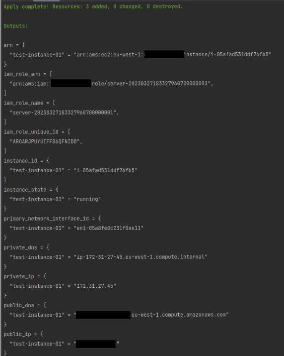

# terraform-aws-ec2-module

This is a sample of AWS EC2 Terraform module.

_____
## An overview of Terraform files:

### `data.tf:`
- In this file, there are following data blocks that I used:
  - `aws_ami` : It is Ubuntu 22 OS, you can use it, or you can easily define your AMI id variable inside terraform.tfvars
  - `aws_partition`: This block will lookup information about the current AWS partition in which Terraform is working. (I will use its dns_suffix output in the following data resource)
  - `aws_iam_policy_document`: In aws_iam_policy_document I wrote an IAM policy document in JSON format for use in `aws_iam_role` resource. ([More information](https://registry.terraform.io/providers/hashicorp/aws/latest/docs/data-sources/iam_policy_document))


### `locals.tf:`
- Locals are useful to use when you want to give the result of an expression and then re-use that result throughout your configuration. That's why I used locals to create iam_role_name and a list of instance_names.

### `main.tf:`
- In this file I defined the main structure of Terraform script which:
  - Will create one or more EC2 instances. (default number of instances (`instance_count`) to create is set to 1, and the default `environment` is set to 'test'. So you can change them by defining these variables.)
  - Will create an IAM role, and an IAM instance profile. (An instance profile is a container for an IAM role that we can use to pass role information to an EC2 instance when the instance starts, that's why I defined an `aws_iam_instance_profile`)
  - Will create two security groups to allow outgoing traffic and allow incoming ssh connections on port 22 if variable `create_sg` is set to `true` . the default value for `create_sg` is false, so if you want to create these security groups, define it in tfvars and set it to `true`.
    - (**Note:** even if the `create_sg` is set to **false**, the AWS will create `outgoing` security group by default.)

_____
## How to set-up to run on your environment and AWS:
1. Take a look at `variables.tf`, and see what variables are defined and you want to define your values for them in tfvars.
2. Don't forget to specify `region` and `instance_type` in terraform.tfvars
3. Run the following commands to initialize the Terraform and push the settings to AWS:
   ```bash
   terraform init
   terraform validate
   terraform plan
   terraform apply
    ```
   

____
## Sample output, after creating the instance:
\

